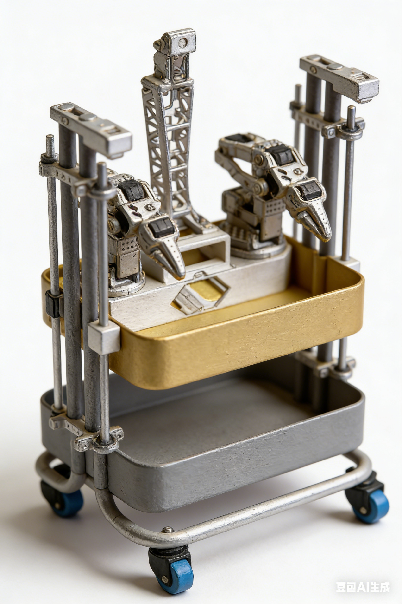
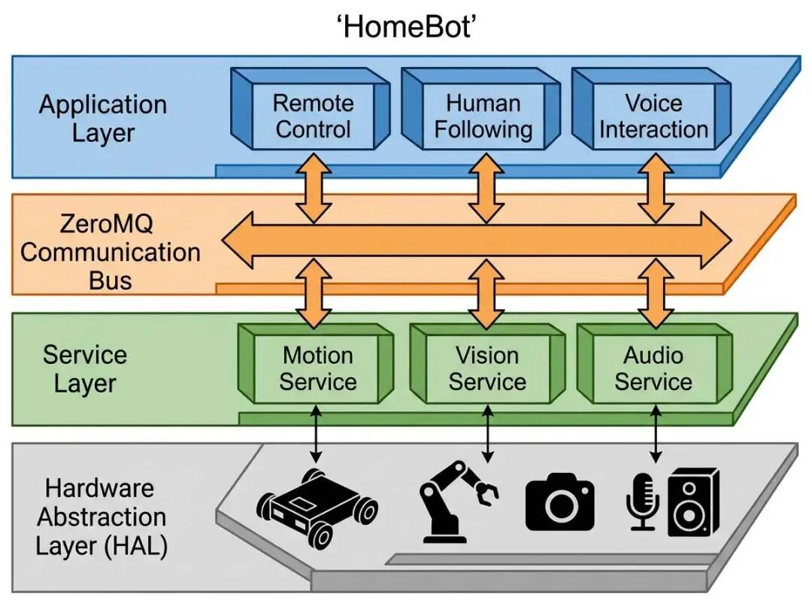

# HomeBot

HomeBot 是一个面向家庭场景的轻量级机器人项目，采用 **分层模块化架构** 和 **ZeroMQ** 通信总线，支持手机遥控、语音交互、模仿学习、人体跟随等多种应用。



## 系统架构



## 项目结构

```
homebot/
├── docs/                      # 文档 (中文)
├── hardware/                  # 硬件设计文件（STEP, STL）
│   └── structure/
├── software/                  # 软件代码
│   ├── src/
│   │   ├── common/            # 公共工具、消息定义、配置类
│   │   ├── configs/           # 运行时配置 (config.py)
│   │   ├── applications/      # 应用层
│   │   │   ├── remote_control/    # 网页遥控端 (含视频流)
│   │   │   ├── human_follow/      # 人体跟随 (YOLO + 视觉伺服)
│   │   │   ├── speech_interaction/# 语音交互
│   │   │   └── imitation_learning/# 模仿学习
│   │   ├── services/          # 服务层
│   │   │   ├── motion_service/    # 底盘控制服务
│   │   │   │   └── chassis_arbiter/  # 仲裁器核心
│   │   │   └── vision_service/    # 视觉服务 (图像采集发布)
│   │   ├── hal/               # 硬件抽象层
│   │   │   ├── camera/        # 摄像头驱动
│   │   │   ├── chassis/       # 底盘驱动
│   │   │   └── ftservo_driver.py  # 飞特舵机底层驱动
│   │   ├── examples/          # 示例代码
│   │   └── tests/             # 测试代码
│   ├── models/                # 机器学习模型 (YOLO26 等)
│   ├── tools/                 # 辅助脚本（模型下载等）
│   ├── start_system.py        # 跨平台系统启动器
│   ├── start_human_follow.py  # 启动人体跟随
│   └── start_chassis_service.py
├── requirements.txt           # Python 依赖
├── pyproject.toml             # 构建系统配置
├── setup.py                   # 包安装配置
└── README.md                  # 项目说明
```

## 特性

- **纯 Python 实现**，轻松跨平台（Windows、Linux、Mac、树莓派）
- **ZeroMQ 通信总线**，低延迟，低资源消耗
- **网页遥控端**，支持手机/平板/PC，实时视频流显示
- **人体跟随**，基于 YOLO26 的视觉伺服自动跟随
- **紧急停止锁定**，触发后需手动归位解锁，确保安全
- **一键启动脚本**，自动检查端口占用，启动所有服务
- **硬件抽象层**，可适配不同传感器与执行器
- **分层模块化**，易于扩展新功能

## 安装

```bash
# 在项目根目录
python -m pip install -e .
```

或手动安装依赖：

```bash
pip install -r requirements.txt
```

## 快速开始

### 基本配置

机器人相关配置统一保存在`software/src/config/configs.py`中
必须进行的配置：底盘和机械臂串口设置
```
@dataclass
class ArmConfig:
    """机械臂配置"""
    serial_port: str = "/dev/tty.usbmodem5AE60527771"  # 默认与底盘共用串口，也可独立配置
    baudrate: int = 1000000
    # 剩余配置略
    
@dataclass
class ChassisConfig:
    """底盘配置 - 从机器人配置文件读取"""
    # 串口配置（Windows: COM3, Linux: /dev/ttyUSB0）
    serial_port: str = "/dev/tty.usbmodem5AE60527771" # 默认与机械臂共用串口，也可独立配置
    baudrate: int = 1000000
    # 剩余配置略
```
更多配置选项说明详见 [配置修改说明](docs/配置修改说明.md)

### 一键启动服务

```bash
cd software
python start_system.py
```

这会启动三个服务：
- **底盘服务&机械臂服务** (ZeroMQ: tcp://127.0.0.1:5556 & tcp://127.0.0.1:5557)
- **视觉服务** (Camera PUB: tcp://127.0.0.1:5560)
- **Web 控制端** (Flask: http://0.0.0.0:5000)

启动时会检查端口占用，如有占用会提示处理。

### 控制方式1：访问web控制界面

打开局域网内手机/电脑浏览器，访问：
```
http://<robot-ip>:5000
```

界面包含：
- **实时视频流**（摄像头画面）
- **虚拟摇杆**（左侧控制底盘移动）
- **紧急停止按钮**（红色，触发后锁定底盘）
- **归位按钮**（蓝色，解锁紧急停止）

### 控制方式2：AI 助手控制（Picoclaw）

通过 [Picoclaw（小龙虾）](docs/用Picoclaw小龙虾控制HomeBot.md) AI 助手实现自然语言控制：

```
"让机器人前进 20 厘米"
"右转 90 度"
"机器人看到了什么？"
```

Picoclaw 会自动解析指令并控制机器人，支持底盘运动、机械臂控制、视觉查询等功能。

详情请查看 👉 [用 Picoclaw 控制 HomeBot 完整指南](docs/用Picoclaw小龙虾控制HomeBot.md)


## 人体跟随功能

HomeBot 提供基于 **YOLO26** 的实时人体跟随功能，支持视觉伺服控制，让机器人自动跟随目标人体。

### 技术特性

| 特性 | 说明 |
|------|------|
| **检测模型** | YOLO26-nano (~2.4MB) |
| **检测速度** | CPU 38ms/帧，比 YOLO11 快 43% |
| **跟踪算法** | IoU 匹配 + 卡尔曼滤波 |
| **控制算法** | 视觉伺服 (Visual Servoing) |
| **控制优先级** | auto=3（可被 emergency 抢占）|

### 快速开始

```bash
# 1. 启动底盘服务
cd software/src
python -m services.motion_service.chassis_service

# 2. 启动视觉服务
cd software/src
python -m services.vision_service

# 3. 启动人体跟随（终端 3）
cd software
python start_human_follow.py --display
```

### 运行模式

- **FOLLOWING**: 正常跟随目标
- **SEARCHING**: 目标丢失，原地旋转搜索
- **IDLE**: 空闲状态
- **PAUSED**: 暂停状态

### 控制逻辑

- **水平控制**：目标在画面左侧 → 左转，右侧 → 右转
- **距离控制**：目标太小（太远）→ 前进，太大（太近）→ 后退
- **丢失处理**：短暂丢失时旋转搜索，完全丢失时停止

### 配置参数

编辑 `software/src/configs/config.py`：

```python
@dataclass
class HumanFollowConfig:
    model_path: str = "models/yolo26n.pt"
    target_distance: float = 1.0        # 目标距离（米）
    kp_linear: float = 0.001            # 线速度 P 系数
    kp_angular: float = 0.003           # 角速度 P 系数
    max_linear_speed: float = 0.3       # 最大线速度
    max_angular_speed: float = 0.8      # 最大角速度
    max_tracking_age: int = 30          # 最大丢失帧数
```

更多详情请查看 [人体跟随使用指南](docs/人体跟随使用指南.md)。

## 网页遥控端功能

### 视频流显示
- 自动连接 VisionService 获取摄像头画面
- 支持 MJPEG 实时流播放
- 断线自动检测，显示离线状态

### 紧急停止机制
- 点击**紧急停止** → 底盘立即停止，进入**锁定状态**
- 锁定期间：
  - 摇杆操作被忽略
  - 底盘拒绝所有运动命令
  - 按钮显示"已锁定"
- 点击**归位** → 解除锁定，恢复正常控制

### 状态指示
- **WebSocket 状态** - 连接状态指示灯
- **仲裁器状态** - 底盘服务连接状态
- **视频状态** - LIVE / OFFLINE
- **FPS 显示** - 摇杆指令发送频率

## 开发规范

### 启动服务模块

```bash
# 底盘服务
python -m services.motion_service.chassis_service [--port COM3]

# 视觉服务  
python -m services.vision_service [--display]

# Web 控制端
python -m applications.remote_control [--host 0.0.0.0] [--port 5000]

# 人体跟随
python -m applications.human_follow [--display]
```

### 订阅图像流

```python
from services.vision_service import VisionSubscriber
import cv2

sub = VisionSubscriber("tcp://localhost:5560")
frame_id, frame = sub.read_frame()  # 读取单帧

# 或持续读取
sub.read_loop(callback=process_frame)
```

### 消息格式

底盘控制命令：
```python
{
    "source": "web",        # 控制源: web/voice/auto/emergency/home
    "vx": 0.5,              # 线速度 X (m/s)
    "vy": 0.0,              # 线速度 Y (m/s)
    "vz": 0.3,              # 角速度 Z (rad/s)
    "priority": 1           # 优先级: 1=web, 2=voice, 3=auto, 4=emergency
}
```

### 自定义应用开发

[HomeBot新应用开发指南](docs/HomeBot新应用开发指南.md)

## 扩展

- **AI 助手控制** - 通过 [Picoclaw](docs/用Picoclaw小龙虾控制HomeBot.md) 用自然语言控制机器人

可在后续迭代中添加：
- **MQTT 桥接** - 云端远程控制
- **多机器人协同** - 分布式任务
- **SLAM 导航** - 自主建图与定位
- **语音交互** - 集成大语言模型
- **模仿学习** - 兼容 LeRobot 框架

---

*Last updated: 2026-03-10*
